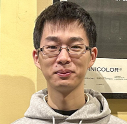

## About Me

Hello mate! I am a Postdoc at the King's College London. I obtained my PhD degree in Computer Science from the University of Warwick, focusing on the combination of seq2seq models and dense representation learning. Currently I'm working on the alignment of instruction-tuned models and narrative datasets. I've published more than 10 papers, and served as a reviewer/PC member in over 10 journals/conferences.

## Publications

<ins>Radiology Report Generation and Disease Recognition</ins>

- J. Wang, L. Zhu, A. Bhalerao and Y. He. [Scene Graph Aided Radiology Report Generation](https://arxiv.org/pdf/2403.05687.pdf). Under Review.
- J. Wang, L. Zhu, A. Bhalerao and Y. He. [Can Prompt Learning Benefit Radiology Report Generation?](https://arxiv.org/pdf/2308.16269.pdf) Under Review.

## Honors and Awards

* aa
* aa
<!-- 
This is a [link](http://google.com). Something *italics* and something **bold**.

Here is a table

Year | Award | Category
-----|-------|--------
2014 | Emmy  | Won Outstanding Lead Actor in a miniseries or a movie
2015 | BAFTA | Nominated for Best Leading Actor for Sherlock
2014 | Satellite | Won Best Actor miniseries or television film

Here is a horizontal rule

---

Here is a blockquote

> To a great mind, nothing is little

## References

* Foo Bar: Head of Department, Placeholder Names, Lorem
* John Doe: Associate Professor, Department of Computer Science, Ipsum -->
